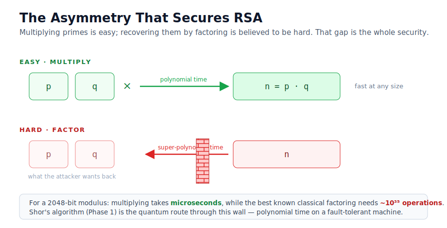
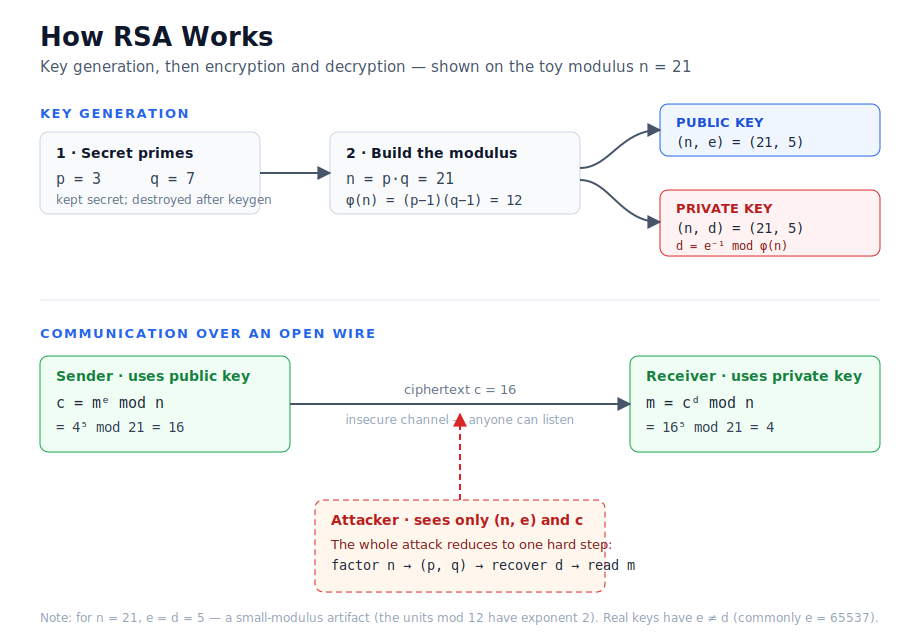
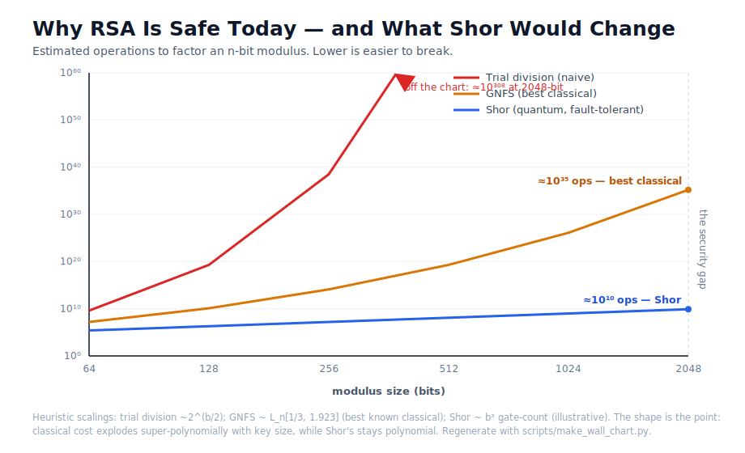

# Part 0 — Why RSA Works (and What It Would Take to Break It)

> This is the first installment of a build-in-the-open series. We are going to
> watch a quantum computer attack RSA, understand *exactly* what it does and does
> not accomplish, and end at the post-quantum cryptography that replaces it. But
> before we can appreciate the attack, we need to understand the target. This part
> introduces no quantum computing at all — and that is deliberate. You cannot
> judge what Shor's algorithm buys you until you know precisely what problem it
> solves.

## The problem

Two strangers who have never met need to agree on a secret over a wire that
everyone can listen to. That is the founding problem of public-key cryptography,
and RSA (Rivest–Shamir–Adleman, 1977) was the first practical answer. Its
security rests on a single, elegant asymmetry: multiplying two large prime
numbers is easy, but recovering those primes from their product — *factoring* —
appears to be hard.

"Appears to be hard" is doing enormous work in that sentence, and interrogating
it honestly is the through-line of this entire series.

## The intuition

Think of the modulus `n = p × q` as a locked box. Anyone can lock it (encrypt)
using the public key. Only someone who knows how the box was built — the two
prime factors `p` and `q` — can unlock it (decrypt). The public key is
deliberately constructed so that it reveals `n` but not `p` and `q`.

The entire edifice therefore reduces to one question: *given `n`, how hard is it
to recover `p` and `q`?* For a 2048-bit modulus, the best known classical
algorithms would need longer than the age of the universe. That gap — between the
ease of multiplying and the difficulty of factoring — is the security.



## The mathematics

RSA is built from a small stack of results you can hold in your head at once.

**Key generation.** Pick two distinct primes `p` and `q` and form `n = p·q`.
Compute Euler's totient `φ(n) = (p − 1)(q − 1)`, the count of integers below `n`
that are coprime to it. Choose a public exponent `e` with `1 < e < φ(n)` and
`gcd(e, φ(n)) = 1`. Compute the private exponent `d` as the modular inverse of
`e`:

```
d ≡ e⁻¹ (mod φ(n))
```

The modular inverse exists precisely because `gcd(e, φ(n)) = 1` — this is
Bézout's identity, made constructive by the extended Euclidean algorithm.

**Encryption and decryption.** With public key `(n, e)` and private key `(n, d)`:

```
encrypt:  c = mᵉ mod n
decrypt:  m = cᵈ mod n
```

**Why decryption undoes encryption.** Because `d·e ≡ 1 (mod φ(n))`, Euler's
theorem gives `m^(d·e) ≡ m (mod n)` for messages coprime to `n` (and, via the
Chinese Remainder Theorem, for all `m < n`). The two operations are genuine
inverses.

Notice what secures `d`: it is derived from `φ(n)`, and `φ(n) = (p−1)(q−1)`
requires knowing `p` and `q`. **Learn the factors and you learn the private key.**
Hold onto that sentence; it is the hinge the entire series turns on.



## A worked toy: n = 21

Throughout the series our canonical toy modulus is `n = 21`. It is large enough
to exercise every step of the real algorithm and small enough to verify by hand
or on a simulator.

```
p = 3, q = 7        →  n = 21
φ(n) = 2 × 6        =  12
e = 5               (smallest exponent coprime to 12)
d = 5⁻¹ mod 12      =  5      because 5 × 5 = 25 ≡ 1 (mod 12)

encrypt m = 4:   c = 4⁵ mod 21 = 16
decrypt c = 16:  m = 16⁵ mod 21 = 4    ✓
```

### An honest caveat about the toy

For `n = 21` we get `e = d = 5`, which looks alarming — as if the "private" key
were public. It is not a flaw in RSA; it is an artifact of a tiny modulus. The
group of units mod `φ(21) = 12` has exponent 2, so *every* valid exponent is its
own inverse. This never happens for realistically sized keys, where `e` (commonly
65537) and `d` are wildly different numbers. The code flags this case explicitly
(`RSAKeyPair.exponents_coincide`) so no one over-generalises from the toy. Being
this careful about a detail most tutorials skip is precisely the standard we hold
the quantum claims to later.

## The implementation

The Phase 0 code is deliberately schoolbook RSA on integers — no OAEP padding, no
constant-time arithmetic, no side-channel hardening — because the goal is to make
the mathematics *visible*, not to ship production crypto. Everything lives in a
small, typed, tested library (`qcrypto.classical`) so that the terminal
demonstrations and the notebooks share one implementation.

You can watch the whole story in one command:

```
qcrypto rsa-demo
```

It walks through five stages — choose the primes, generate the keys, encrypt,
decrypt, and then **break the key classically** by factoring `n` and
reconstructing `d`. That last stage is the point of the whole exercise.

## Results: factoring *is* breaking

Here is the thesis stated operationally. An attacker who sees only `(n, e)` and a
ciphertext needs to do exactly one hard thing — factor `n` — after which
recovering the private key is elementary arithmetic:

```
factor(21)            →  (3, 7)          [pollard_rho, a few microseconds]
recover d from p, q   →  d = 5
decrypt the message   →  4
```

There is no separate "decryption break." The private key falls out of the
factorisation. This is why the whole of RSA's security is identical to the
hardness of factoring — and why the interesting question is not "can we decrypt?"
but "can we factor?"

The Phase 0 library ships three classical factoring baselines — trial division,
Fermat's method, and Pollard's rho — so that when Shor arrives we can make a
*fair* comparison instead of the usual breathless "a quantum computer factored
21!" (a number your phone factors in nanoseconds).

## Limitations (the honest part)

Classical factoring is not helpless — Pollard's rho and the general number field
sieve are genuinely clever — but every known classical method is
*super-polynomial* in the number of digits of `n`. Doubling the key size does not
double the attacker's work; it raises it astronomically. That is why RSA-2048 is
considered safe against all classical computers for the foreseeable future.



The reason we are writing this series is that a *quantum* algorithm — Shor's —
factors integers in polynomial time, collapsing that super-polynomial wall. In
Part 1 we build Shor's algorithm and run it on our toy modulus, first on a
simulator and then, honestly, on real IBM Quantum hardware — where we will
confront exactly how far today's machines are from threatening a real key.

## Real-world relevance

RSA is not a museum piece. It still protects TLS handshakes, code-signing,
SSH keys, and countless embedded systems. The reason this matters *now*, years
before a cryptographically relevant quantum computer is expected to exist, is
**harvest-now, decrypt-later**: an adversary can record encrypted traffic today
and decrypt it the day such a machine arrives. Data with a long confidentiality
lifetime — medical records, state secrets, identity documents — is already at
risk in a way that "quantum computers don't exist yet" does not address. That is
the stakes we are building toward.

---

### What's next

**Part 1 — Shor's Algorithm on a Simulator.** We reframe factoring as
*period-finding*, build the quantum circuit for `n = 21` in Qiskit, and watch the
Quantum Fourier Transform reveal the period that hands us `p` and `q`. We will
also confront the field's most important honesty problem head-on: the difference
between a genuine Shor circuit and the "compiled-with-the-answer" demonstrations
that have muddied the public record.

---

*Figures for this part live in [`figures/`](figures/) as white-background SVGs.
The exponential-wall chart is reproducible via
[`scripts/make_wall_chart.py`](../../scripts/make_wall_chart.py).*
