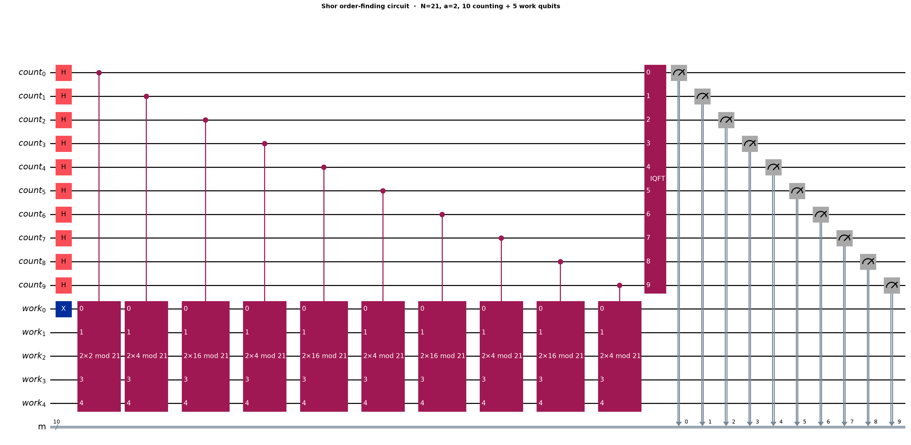
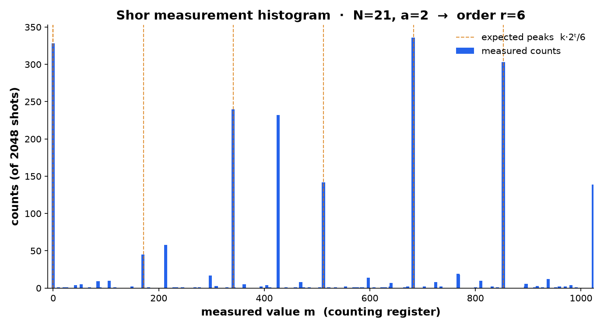

# Part 1 — Shor's Algorithm on a Simulator: Watching a Number Factor Itself

> In [Part 0](00-why-rsa-works.md) we established the thesis: RSA's security *is*
> the hardness of factoring the modulus `n`, and the moment you can factor, the
> private key falls out by elementary arithmetic. Classical factoring hits an
> exponential wall. This part builds the algorithm that walks through it — Shor's
> — and runs it on a real quantum simulator to factor our toy modulus `N = 21`.
> Everything here actually executes; the numbers below come from a seeded run you
> can reproduce with `qcrypto shor-demo`.

## The problem

Factoring `N` looks like a search problem, and search is where we expect quantum
computers to help only modestly (Grover, quadratic — that's Part 3). Shor's
insight is that factoring is *not* really a search problem. It is a **periodicity**
problem in disguise, and periodicity is exactly what a quantum computer, through
interference, finds exponentially faster than we know how to classically.

## The intuition

Pick a number `a` with no common factor with `N`, and look at the sequence

```
a¹, a², a³, … (mod N)
```

This sequence always repeats. The length of the repeat is the **order** `r`: the
smallest `r > 0` with `a^r ≡ 1 (mod N)`. For `N = 21`, `a = 2`:

```
2, 4, 8, 16, 11, 1, 2, 4, 8, 16, 11, 1, …   →   period r = 6
```

Why does the period help us factor? If `r` is even, then `a^r − 1 = (a^{r/2} − 1)(a^{r/2} + 1)`
is a multiple of `N`. So unless `a^{r/2} ≡ −1 (mod N)`, the two factors
`gcd(a^{r/2} ± 1, N)` share pieces of `N` with us. For `a = 2`, `r = 6`:
`a^{r/2} = 2³ = 8`, and `gcd(7, 21) = 7`, `gcd(9, 21) = 3`. There are our factors.

Finding `r` classically is as hard as factoring. The quantum computer finds it by
preparing a superposition over all exponents at once, letting the periodic
structure interfere, and reading the period out of the interference pattern with a
Quantum Fourier Transform.

## The mathematics

The quantum step is **phase estimation** of the "multiply-by-`a`" operator
`U_a |y⟩ = |a·y mod N⟩`. Its eigenvalues are `e^{2πi·s/r}` for integers `s`.
Estimating one of those phases gives us `s/r`; a continued-fraction expansion then
extracts the denominator `r`.

Concretely, with a `t`-qubit counting register we build the state

```
(1/√2ᵗ) Σ_x |x⟩ |aˣ mod N⟩
```

Measuring (or just tracing out) the work register collapses it to a single value
and leaves the counting register periodic with period `r`. An inverse QFT turns
that periodicity into sharp peaks at measured values `m ≈ k·2ᵗ/r`. We read `m`,
form `m/2ᵗ ≈ s/r`, and recover `r` by continued fractions. All of that
post-processing is classical and lives, fully unit-tested, in
`qcrypto.quantum.post_process`.

## The algorithm

1. If `N` is even or a prime power, handle classically. Otherwise pick `a`.
2. If `gcd(a, N) > 1` you got lucky — that gcd is a factor, no circuit needed.
3. Otherwise run quantum order-finding to get `r`.
4. If `r` is even and `a^{r/2} ≢ −1`, return `gcd(a^{r/2} ± 1, N)`.
5. Else retry with another `a`.

Only step 3 is quantum. This is worth repeating because breathless coverage often
implies the quantum computer "breaks the encryption" — it does one thing: it finds
a period.

## The implementation

The order-finding circuit (`qcrypto.quantum.shor.build_order_finding_circuit`) has
three parts: Hadamards to put the counting register in uniform superposition; a
controlled modular-exponentiation block; and an inverse QFT before measurement.



The modular-exponentiation block uses the standard trick that
`(U_a)^{2^j} = U_{a^{2^j} mod N}`: instead of repeating a multiplier `2^j` times, we
compute the classical constant `a^{2^j} mod N` and apply a single controlled
multiplier for it, one per counting qubit.

### The honesty section (this is the important part)

There is a spectrum of "honesty" in Shor demonstrations, and this project sits at
a deliberate, clearly-labelled point on it.

At the dishonest end are the infamous experiments that "factor 15" (or 21) using a
circuit that was **pre-simplified using knowledge of the answer**. Smolin, Smith,
and Vargo showed that, taken to its logical end, this trick can "factor" arbitrarily
large numbers with almost no real computation — because the circuit has the period
baked in. Such demonstrations tell you nothing about whether the machine could
factor a number nobody knows the answer to.

Our circuit does **not** do that. It runs genuine period-finding: the period `r`
emerges from interference and is read out; nothing about `r = 6` is hardcoded. That
is the honest core.

But we are transparent about where we compromise: our modular multiplier is built
as an explicit permutation *unitary* (`|y⟩ → |a·y mod N⟩`) handed to the simulator,
rather than synthesised from Toffoli/adder primitives the way a fault-tolerant
machine would need (e.g. Beauregard's QFT-adder construction). That is why our
transpiled depth is only ~13: we are paying in *classical* matrix construction what
a real device would pay in *quantum* depth. The permutation is genuine and the
period-finding is real, but the depth you see is not representative of what real
hardware faces — a point we return to under Limitations, and demonstrate viscerally
in Part 2 on actual hardware.

## Visualization and results

Running `qcrypto shor-demo` (N = 21, a = 2, 10 counting qubits + 5 work qubits =
15 total, seed 42, 2048 shots) produces the following measurement histogram:



The dominant outcomes are:

| measured `m` | phase `m/2¹⁰` | ≈ `s/r` | shots |
|---:|---:|:--|---:|
| 682 | 0.666 | 2/3 | 336 |
| 0   | 0.000 | 0/1 (useless) | 328 |
| 853 | 0.833 | 5/6 | 303 |
| 341 | 0.333 | 1/3 | 240 |
| 426 | 0.416 | ~5/12 (spillover) | 232 |
| 512 | 0.500 | 1/2 | 142 |

The peaks cluster at the best integer approximations to `k·2¹⁰/6 ≈ k·170.67`
(i.e. 0, 171, 341, 512, 683, 853). Because 6 does not divide 1024, the amplitude
is not perfectly concentrated — hence the modest spillover (e.g. `m = 426`) and the
one-off `682` instead of `683`. This spreading is itself instructive: it is exactly
why we need `2ᵗ ≥ N²` resolution and continued fractions rather than reading `r`
directly.

Feeding, say, `m = 853` through continued fractions gives `853/1024 → 5/6`, whose
denominator `6` satisfies `2⁶ ≡ 1 (mod 21)`. Even the "worse" peak `m = 341 → 1/3`
recovers `r` after testing multiples (`2³ ≠ 1`, but `2⁶ = 1`). The algorithm reports:

```
recovered order r = 6
2⁶ mod 21 = 1  ✓
gcd(2³ ± 1, 21) → (3, 7)
21 = 3 × 7
```

This is the *same* factorization Part 0 obtained classically — but reached through
quantum period-finding. On a fault-tolerant machine, this is precisely the step
that would recover an RSA private key from a public modulus.

## Limitations (stated plainly)

Three honest caveats, in ascending order of importance:

First, this is a **simulator**. The 15-qubit statevector is computed exactly, with
no noise. Real devices decohere.

Second, our modular multiplier is **simulator-scale by construction** — it
materialises a `2⁵ × 2⁵` permutation. That does not scale, and its shallow depth is
not what a gate-level arithmetic implementation would incur. We chose transparency
of *what the oracle does* over fidelity to *how hardware would build it*; Part 2
confronts the real cost.

Third, and most importantly: **none of this threatens real RSA**. Factoring 21 is a
pedagogical exercise; your phone does it in nanoseconds. The gap to RSA-2048 is not
incremental. Current estimates put a genuine attack at on the order of a million
noisy qubits running for days (Gidney 2025), versus the ~156-qubit, noisy devices
available today. Part 0's exponential-wall chart is the honest picture; this part
shows the *mechanism* that would, someday, climb it — not a machine that can.

## Real-world relevance

If a cryptographically relevant quantum computer is years away, why care now? Because
of **harvest-now, decrypt-later**: encrypted traffic recorded today can be decrypted
the day such a machine exists. Data with a long confidentiality lifetime is already
exposed. That is the motivation for migrating to post-quantum cryptography — which is
where this series is headed (Part 4, ML-KEM).

---

### What's next

**Part 2 — Shor on Real IBM Quantum Hardware.** We take the same circuit to an
actual device, and confront everything the simulator hid: transpilation onto a real
coupling map, gate errors, decoherence, and why an *honest* end-to-end Shor run is
still out of reach on today's noisy hardware — the concrete face of the limitations
above.

---

*Figures for this part are generated by [`scripts/make_shor_figures.py`](../../scripts/make_shor_figures.py)
from a seeded run, so they match the numbers quoted here.*
