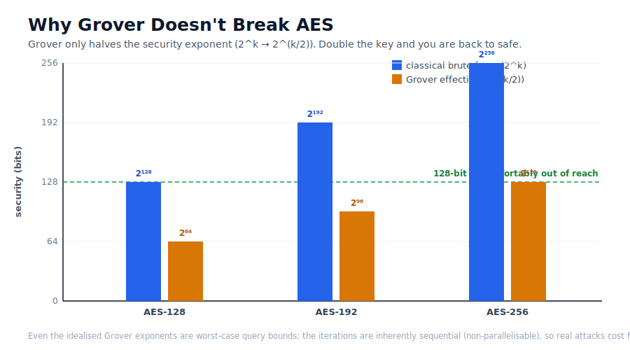

# Part 3 — Grover's Algorithm, and Why Your AES Keys Are Fine

> Parts 1 and 2 showed Shor tearing through the *structured* problem of factoring
> with an exponential speedup. That is what puts RSA on notice. The natural next
> fear is: "if a quantum computer can break RSA, surely it breaks AES too?" It does
> not — and understanding *why* is one of the most clarifying ideas in the whole
> field. The answer is Grover's algorithm, and the key word is **quadratic**.

## The problem

Breaking a symmetric cipher like AES by brute force is **unstructured search**:
you have a black box (does this key decrypt the intercepted ciphertext to something
sensible?) and 2^k candidate keys with no exploitable structure — no periodicity,
no ordering, nothing. Classically, you expect to try about half of them: ~2^(k−1).

Grover's algorithm is the optimal quantum algorithm for exactly this black-box
search. The question is how much it helps.

## The intuition

Grover works by **amplitude amplification**. Start in an equal superposition over
all 2^k candidates, so each has a tiny amplitude 1/√N. Then repeat two steps:

1. An **oracle** flips the sign of the marked item's amplitude.
2. A **diffuser** reflects all amplitudes about their mean.

Geometrically, each round rotates the state a little closer to the marked item.
After about (π/4)·√N rounds, the marked item's probability is near 1. The critical
fact is in that √N: Grover needs on the order of **√N queries, not N**. For a k-bit
key, √(2^k) = 2^(k/2). Grover *halves the exponent*.


Notice what the curve also shows: overshooting the optimal iteration count makes it
*worse* again. Grover is a rotation, not a ratchet — more is not better.

## The mathematics

Let θ = arcsin(√(M/N)) for M marked items among N. After k iterations the success
probability is

```
P(k) = sin²((2k + 1)·θ)
```

which is maximised near k ≈ (π/4)·√(N/M). This is a provable *quadratic* speedup,
and — importantly — it is also provably *optimal*: no quantum algorithm searches an
unstructured space faster than √N (Bennett–Bernstein–Brassard–Vazirani). There is
no hidden exponential win waiting to be discovered for symmetric key search.

## The implementation

`qcrypto.quantum.grover` builds a genuine Grover circuit: `build_oracle` marks the
target by mapping it to |11…1⟩ and applying a multi-controlled Z; `build_diffuser`
implements inversion about the mean; `build_grover_circuit` stacks the optimal
number of rounds. You can watch it on a toy space:

```
qcrypto grover-demo --qubits 4 --marked 9
```

Marking item 9 in a space of 2⁴ = 16 with the optimal 3 iterations concentrates the
measurement on the right answer:


A deliberate scope note, in the same spirit as the Shor "honesty section": we run
Grover on a *toy* marked space, **not** against a real AES oracle. Building a
reversible quantum circuit for AES and running 2^64 sequential Grover iterations is
astronomically infeasible; demonstrating the *mechanism* on 16 items and then
reasoning about scaling is the honest way to teach this.

## Results: why AES survives

Here is the punchline, and the reason quantum computing does not "break AES" the way
it breaks RSA:



| Cipher | Classical | Grover (idealised) | NIST PQ category |
|---|---:|---:|:--:|
| AES-128 | 2¹²⁸ | 2⁶⁴ | 1 |
| AES-192 | 2¹⁹² | 2⁹⁶ | 3 |
| AES-256 | 2²⁵⁶ | 2¹²⁸ | 5 |

Two things make this far less alarming than "2⁶⁴" sounds:

First, **halving the exponent is not collapsing it.** AES-256 under Grover still
demands ~2¹²⁸ work — the same bar we consider safe for classical AES-128 today. The
mitigation is trivial and already standard: prefer 256-bit keys.

Second — and this is the part the scary headlines omit — **Grover barely
parallelises.** Its ~2^(k/2) iterations are inherently *sequential* (each round
depends on the previous state), so unlike classical brute force you cannot simply
throw a million machines at it for a linear speedup. Zalka's analysis and NIST's own
post-quantum rationale both conclude the real-world cost is much worse than 2^(k/2)
suggests. This is why NIST still rates AES-128 as post-quantum Category 1.

Contrast this with RSA. Shor is *exponential*, so doubling the modulus size does not
buy you a matching jump in the attacker's cost — the wall moves, but Shor scales
polynomially past it. That asymmetry — exponential Shor vs. quadratic Grover — is
precisely why the post-quantum migration is urgent for *asymmetric* crypto (RSA, ECC)
and merely a "use bigger keys" footnote for *symmetric* crypto (AES).

## Limitations

Everything here is a noise-free simulation of a toy space. Real Grover-on-AES is not
remotely feasible on current or near-future hardware, and this project does not claim
otherwise. The value is conceptual: Grover is the *best possible* unstructured-search
speedup, it is only quadratic, and that ceiling is what protects symmetric
cryptography.

## Real-world relevance

The practical guidance that falls out of this is refreshingly concrete: for symmetric
crypto, **move to 256-bit keys** (AES-256) and you are post-quantum secure — no exotic
new algorithm required. The hard problem is *asymmetric* crypto, where "bigger keys"
does not work and we need genuinely new mathematics. That is the subject of the finale.

---

### What's next

**Part 4 — ML-KEM: The Post-Quantum Replacement.** RSA and ECC need to be replaced,
not resized. We look at ML-KEM (FIPS 203, formerly Kyber), the NIST-standardised
lattice-based key-encapsulation mechanism, walk through an encapsulation/decapsulation
round trip, and explain why lattice problems resist *all known* quantum attacks —
carefully distinguishing "no known quantum algorithm" from "proven hard."

---

*The SVG is committed; the PNG figures are generated by
[`scripts/make_grover_figures.py`](../../scripts/make_grover_figures.py) from a
seeded run so they match the numbers above.*
