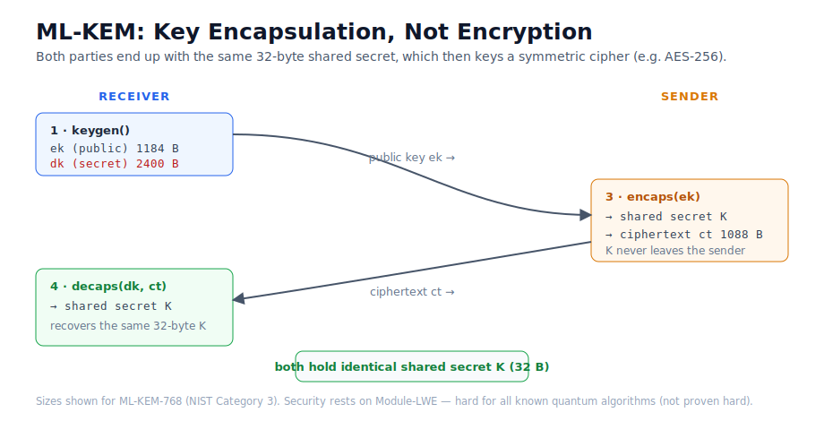

# Part 4 — ML-KEM: The Post-Quantum Replacement

> Part 1 showed Shor dismantling RSA in principle. Part 3 showed that symmetric
> crypto (AES) survives with a simple key-size bump. That leaves the real problem:
> **asymmetric** key exchange — RSA and elliptic-curve Diffie–Hellman — cannot be
> rescued by bigger keys, because Shor is exponential. They must be *replaced*. This
> final part looks at the replacement NIST standardised: ML-KEM.

## The problem

When your browser opens a TLS connection, it performs an asymmetric key exchange to
agree on a symmetric session key. Today that is RSA or (more often) ECDH. Both fall
to Shor: RSA to factoring, ECDH to the closely-related discrete-log period-finding.
Doubling key sizes does not help — the whole point of Parts 0–1 is that Shor scales
*polynomially* past any key size we can practically deploy.

So we need a key-exchange primitive built on a problem with **no known efficient
quantum algorithm**. After a multi-year public competition, NIST standardised one in
2024 as **FIPS 203: ML-KEM** (Module-Lattice-Based Key-Encapsulation Mechanism),
derived from CRYSTALS-Kyber.

## The intuition

ML-KEM's hardness comes from **lattices**. Informally, the Module Learning-With-Errors
(MLWE) problem asks: given many noisy linear equations `A·s + e ≈ b` over a structured
ring, recover the secret `s`. The added noise `e` is what makes it hard — without it
this is just Gaussian elimination; with it, the best known algorithms (classical *and*
quantum) are exponential.

The honest framing, which the project insists on: lattice problems resist **all known**
quantum attacks. That is different from **proven** quantum-hardness. What we have is a
strong body of cryptanalysis finding no efficient quantum (or classical) attack, plus
worst-case-to-average-case reductions that tie breaking random instances to solving the
hardest lattice instances. That is the current state of the art — not a mathematical
guarantee, and we should not pretend otherwise.

## The mechanism

ML-KEM is a **KEM**, not an encryption scheme. It does not encrypt a chosen message;
it *establishes a shared secret*. The three operations:

```
keygen()        -> (ek, dk)        receiver makes a public/secret key pair
encaps(ek)      -> (K, ct)         sender derives shared secret K and a ciphertext
decaps(dk, ct)  -> K               receiver recovers the same K
```



The shared secret `K` (32 bytes) then keys a symmetric cipher — typically AES-256,
which we established in Part 3 is itself quantum-safe. So the full post-quantum stack
is: ML-KEM to agree on a key, AES-256 to use it.

## The implementation

An explicit note on trust boundaries, consistent with the rest of this project: we do
**not** reimplement lattice cryptography. `qcrypto.pqc.mlkem` wraps the vetted,
pure-Python [`kyber-py`](https://github.com/GiacomoPope/kyber-py) reference
implementation of FIPS 203 and adds only orchestration and size accounting. Rolling
our own ML-KEM would be a large, subtle, security-sensitive effort whose bugs would
undercut the very "correctness over hype" thesis of the series. (Both `kyber-py` and
our wrapper are for learning — neither is side-channel hardened; production systems
should use `liboqs`/`oqs` or a platform-native implementation.)

You can watch a round trip:

```
qcrypto mlkem-demo --parameter-set ML-KEM-768
```

It generates a key pair, encapsulates, decapsulates, and confirms both sides derived
the identical 32-byte secret.

## Results

The standardised parameter sets and their sizes (from FIPS 203):

| Parameter set | NIST category | Public key (ek) | Ciphertext | Shared secret |
|---|:--:|---:|---:|---:|
| ML-KEM-512 | 1 | 800 B | 768 B | 32 B |
| ML-KEM-768 | 3 | 1184 B | 1088 B | 32 B |
| ML-KEM-1024 | 5 | 1568 B | 1568 B | 32 B |

A round trip on any of them yields matching shared secrets — that is the whole job of a
KEM, and it is what the demo verifies.

## Limitations and trade-offs

The honest cost of post-quantum security is **size**. An RSA-3072 public key (roughly
128-bit classical security) is ~384 bytes; ML-KEM-768's public key is ~1184 bytes, and
its ciphertext ~1088 bytes. That is several times larger, which matters for
bandwidth-constrained protocols and for the size of every TLS handshake.

There is also the residual assurance gap discussed above: "no known quantum attack" is
a strong but not absolute guarantee. Lattice cryptanalysis is an active field.

## Real-world relevance

Two points make this concrete and current:

First, **hybrid deployment**. Because the assurance is not a proof, real systems do not
bet everything on ML-KEM alone. They run it *alongside* a classical primitive — e.g.
X25519 + ML-KEM-768 — so an attacker must break *both*. This hybrid is already deployed
at scale (major browsers and CDNs shipped it in 2024–2025).

Second, **harvest-now, decrypt-later** — the motivation that has run through this whole
series. Traffic recorded today can be decrypted the day a cryptographically relevant
quantum computer exists. That is why migration is happening *now*, years ahead of the
hardware, and why understanding this stack — RSA's vulnerability, Grover's limits, and
ML-KEM's design — is worth the effort.

## The whole story, in one paragraph

Quantum computing does not "break encryption." It breaks *specific* problems. Shor's
exponential speedup breaks the integer-factoring and discrete-log problems that
underpin RSA and ECDH — so those must be replaced. Grover's merely quadratic speedup
only dents symmetric crypto, so AES survives a key-size bump. And ML-KEM replaces the
broken asymmetric primitives with lattice-based ones that resist every known quantum
attack. That is the real shape of quantum computing's impact on cryptography — neither
apocalypse nor non-event, but a specific, addressable migration.

---

*Figure is a committed SVG. The demo uses the `kyber-py` reference implementation via
the `[pqc]` extra (`pip install -e ".[pqc]"`).*
